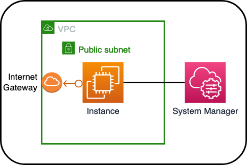

# Example Asterisk EC2 Instance with Cloud-Init and Environment Variables

## Overview



## Installing Instance

```
yarn
yarn cdk deploy
```

## Components

```ts
const vpc = new ec2.Vpc(this, 'VPC', {
  natGateways: 0,
  subnetConfiguration: [
    {
      cidrMask: 24,
      name: 'AsteriskPublic',
      subnetType: ec2.SubnetType.PUBLIC,
    },
  ],
});

const ec2Eip = new ec2.CfnEIP(this, 'ec2Eip');
```

This will create a VPC and an Elastic IP.

```ts
    const ec2Instance = new ec2.Instance(this, 'Instance', {
      vpc,
      instanceType: ec2.InstanceType.of(
        ec2.InstanceClass.T4G,
        ec2.InstanceSize.MICRO,
      ),
      machineImage: new ec2.AmazonLinuxImage({
        generation: ec2.AmazonLinuxGeneration.AMAZON_LINUX_2,
        cpuType: ec2.AmazonLinuxCpuType.ARM_64,
      }),
```

This will create an Amazon Linux 2 T4G.micro EC2 instance within the previously created VPC u

```ts
      init: ec2.CloudFormationInit.fromConfigSets({
        configSets: {
          default: ['install', 'config'],
        },
```

This will begin the cloud-init config of the EC2 instance with two separate config sets that will run sequentially.

```ts
        configs: {
          install: new ec2.InitConfig([
            ec2.InitFile.fromObject('/etc/config.json', {
              IP: ec2Eip.ref,
            }),
            ec2.InitFile.fromFileInline(
              '/etc/install.sh',
              './src/asteriskConfig/install.sh',
            ),
            ec2.InitCommand.shellCommand('chmod +x /etc/install.sh'),
            ec2.InitCommand.shellCommand('cd /tmp'),
            ec2.InitCommand.shellCommand('/etc/install.sh'),
          ]),
```

This will create a JSON file within the EC2 instance using the Elastic IP address as the value of a key:value pair. This can be queried with metadata as well, but for this example, we will use it as a variable created by the CDK that we will pass to the EC2 instance. Additionally, we will upload the [install.sh](../cdk-ec2-example/src/asteriskConfig/config_asterisk.sh) file to the EC2 instance in the `/etc/` directory, allow it to be executed, and then run that bash script. This script will download and install Asterisk.

```ts
          config: new ec2.InitConfig([
            ec2.InitFile.fromFileInline(
              '/etc/asterisk/pjsip.conf',
              './src/asteriskConfig/pjsip.conf',
            ),
            ec2.InitFile.fromFileInline(
              '/etc/asterisk/asterisk.conf',
              './src/asteriskConfig/asterisk.conf',
            ),
            ec2.InitFile.fromFileInline(
              '/etc/asterisk/logger.conf',
              './src/asteriskConfig/logger.conf',
            ),
            ec2.InitFile.fromFileInline(
              '/etc/config_asterisk.sh',
              './src/asteriskConfig/config_asterisk.sh',
            ),
            ec2.InitCommand.shellCommand('chmod +x /etc/config_asterisk.sh'),
            ec2.InitCommand.shellCommand('/etc/config_asterisk.sh'),
          ]),
        },
      }),
```

This will upload several files to the `/etc/asterisk/` directory to configure the Asterisk server. Once uploaded, the `config_asterisk.sh` script will modify the `pjsip.conf` file using the environment variables passed to the instance from the CDK using `sed`:

```bash
IP=$( jq -r '.IP' /etc/config.json )

sed -i "s/IP_ADDRESS/$IP/g" /etc/asterisk/pjsip.conf
```

```ts
      initOptions: {
        timeout: Duration.minutes(15),
      },
```

This will create a timer for the deployment of the Instance and subsequent configuration. If this timer is exceeded, the Cloudformation will rollback. Additionally, the CDK will wait until the cloud-init is succesfully completed before progressing. This will ensure that the Instance is correctly configured and built. If not, the CDK and Cloudformation will RollBack.

```ts
      role: new iam.Role(this, 'ec2Role', {
        assumedBy: new iam.ServicePrincipal('ec2.amazonaws.com'),
        managedPolicies: [
          iam.ManagedPolicy.fromAwsManagedPolicyName(
            'AmazonSSMManagedInstanceCore',
          ),
        ],
      }),
    });
```

This will allow System Manager to be used to Connect to the Instance. To connect to the Instance through the EC2 Console, select the Instance -> Connect:


This will use System Manager to connect to the Instance and give you access to the shell. System Manager will not require a key-pair to SSH to the Instance. To see what has been configured on the Instance, you can view the cloud-init-log: `cat /var/log/cloud-init-output.log`

## Cleanup

```
yarn cdk destroy
```
